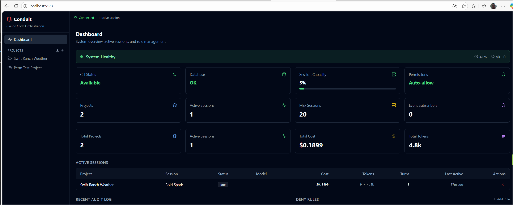

<p align="center">
  
  
  = 18">
  
</p>

# Conduit

**Local orchestration API for Claude Code.** Let your agents, scripts, and frameworks use Claude Code's full capabilities — file I/O, bash, MCP servers — as a REST/WebSocket service on your local network, without exposing your Anthropic API key.

```
┌──────────────┐     ┌───────────────────────────────┐     ┌────────────┐
│  Your Agents  │────▶│           Conduit              │────▶│ Claude Code │
│  (OpenClaw,   │ REST│  ┌─────────┐  ┌────────────┐  │ WS  │    CLI      │
│   scripts,    │  +  │  │ Session  │  │ Permission │  │     │            │
│   VALOR)      │◀────│  │ Manager  │  │  Engine    │  │◀────│  (your     │
│               │ WS  │  └─────────┘  └────────────┘  │     │   login)   │
└──────────────┘     │  ┌─────────┐  ┌────────────┐  │     └────────────┘
                      │  │  Event   │  │   Audit    │  │
                      │  │  Bus     │  │   Log      │  │
                      │  └─────────┘  └────────────┘  │
                      └───────────────────────────────┘
                                Your machine
```

<p align="center">
  
</p>

## Why Conduit?

Claude Code is a powerful agent runtime — it can read and write files, execute shell commands, use MCP servers, and manage complex multi-step tasks. But it's designed as an interactive terminal tool.

**Conduit turns it into a programmable API.** Your agent framework sends a task via REST, Conduit spawns a Claude Code session, bridges communication over WebSocket, and streams results back — all while Claude Code uses *your existing login*. No API keys leave your machine.

**The problem it solves:**
- You want agents to use Claude Code's capabilities, but you can't share your API key
- You need to run multiple Claude Code sessions in parallel across different projects
- You want visibility into what your agents are doing — cost, tokens, tool calls
- You need guardrails to prevent destructive operations without blocking every tool call

## Features

- **Session Orchestration** — Spawn, monitor, and kill Claude Code CLI sessions via REST API
- **Real-time Streaming** — WebSocket and SSE event streams for live session monitoring
- **Cost Tracking** — Per-session and aggregate cost, token, and turn metrics
- **Deny-Rule Guardrails** — Block destructive patterns (e.g. `rm -rf *`) while auto-allowing everything else
- **Audit Trail** — Every tool-permission decision is logged for forensics
- **Project Discovery** — Auto-detect and import project folders from your filesystem
- **Zero Auth Required** — Local network service, no API keys to manage
- **Friendly Naming** — Auto-generated session names (Swift Spark, Bright Pulse) and humanized project names

## Quick Start

### Prerequisites

- **Node.js** >= 18
- **Claude Code CLI** >= v2.1.39 (installed and logged in)

### Install & Run

```bash
git clone https://github.com/swift-innovate/conduit.git
cd conduit

# Install dependencies (backend + UI)
npm install
cd ui && npm install && cd ..

# Start the server
npm run dev
```

Conduit starts at `http://localhost:3100`. The dashboard UI is available at `http://localhost:5173` (Vite dev server).

### Your First Session

```bash
# Import a project
curl -X POST http://localhost:3100/api/projects/import \
  -H "Content-Type: application/json" \
  -d '{"folder_path": "/path/to/your/project"}'

# Create a session (returns session ID)
curl -X POST http://localhost:3100/api/projects/{PROJECT_ID}/sessions \
  -H "Content-Type: application/json" \
  -d '{}'

# Send a task
curl -X POST http://localhost:3100/api/sessions/{SESSION_ID}/message \
  -H "Content-Type: application/json" \
  -d '{"content": "Review the codebase and create a summary of the architecture"}'

# Check status and cost
curl http://localhost:3100/api/sessions/{SESSION_ID}

# Read the response
curl http://localhost:3100/api/sessions/{SESSION_ID}/messages
```

## How It Works

Conduit uses Claude Code's `--sdk-url` flag to spawn CLI sessions in headless mode. Instead of running interactively in a terminal, the CLI connects back to Conduit's WebSocket bridge.

```
1. Agent sends: POST /api/projects/:id/sessions
2. Conduit allocates a WebSocket port and spawns:
   claude --sdk-url ws://localhost:{port} --cwd /project/path
3. CLI connects to the bridge → session is active
4. Agent sends: POST /api/sessions/:id/message
   {"content": "Fix the bug in auth.ts"}
5. Conduit forwards to CLI via WebSocket bridge
6. CLI executes (reads files, runs commands, writes code)
7. Conduit streams events back via SSE/WebSocket
8. Agent reads results: GET /api/sessions/:id/messages
```

All tool-permission requests from the CLI flow through Conduit's rule engine. By default everything is allowed, but deny rules act as circuit breakers for operations you want to block.

## API Overview

Full reference: [API.md](API.md)

| Endpoint | Description |
|----------|-------------|
| `GET /api/health` | Server status and stats |
| `GET /api/projects` | List all projects |
| `POST /api/projects/import` | Import an existing project folder |
| `GET /api/projects/discover?path=...` | Scan filesystem for projects |
| `POST /api/projects/:id/sessions` | Launch a new Claude Code session |
| `GET /api/sessions/:id` | Session status, cost, metrics |
| `POST /api/sessions/:id/message` | Send a task to a session |
| `GET /api/sessions/:id/messages` | Full conversation transcript |
| `GET /api/sessions/:id/stream` | SSE event stream |
| `ws://localhost:3100/api/sessions/:id/ws` | WebSocket for bidirectional comms |
| `DELETE /api/sessions/:id` | Kill a session |
| `GET/POST /api/rules/global` | Manage deny-rule guardrails |
| `GET /api/permissions/log` | Audit trail |

## Configuration

All settings via environment variables. Copy `.env.example` to `.env` to customize:

| Variable | Default | Description |
|----------|---------|-------------|
| `CONDUIT_PORT` | `3100` | HTTP server port |
| `CONDUIT_CLI_PATH` | `claude` | Path to Claude Code CLI |
| `CONDUIT_MAX_SESSIONS_GLOBAL` | `20` | Max concurrent sessions |
| `CONDUIT_WS_PORT_RANGE_START` | `9000` | Bridge port range start |
| `CONDUIT_WS_PORT_RANGE_END` | `9100` | Bridge port range end |
| `CONDUIT_PROJECT_ROOT` | Home dir | Default browse root |

See `.env.example` for the complete list.

## Architecture

```
src/
├── api/            # Hono REST routes + WebSocket endpoint
│   ├── routes.ts       # Route registration
│   ├── projects.ts     # Project CRUD + session creation
│   ├── sessions.ts     # Session lifecycle + messaging
│   ├── permissions.ts  # Rule CRUD + audit log
│   └── ws-external.ts  # External WebSocket consumers
├── bridge/         # Claude Code CLI ↔ Conduit communication
│   ├── cli-launcher.ts # Process spawning with --sdk-url
│   ├── ws-server.ts    # Per-session WebSocket bridge
│   ├── message-router.ts # Event routing + metric extraction
│   ├── protocol.ts     # CLI ↔ SDK message types
│   └── ndjson.ts       # NDJSON stream parser
├── core/           # Business logic
│   ├── engine.ts       # Top-level orchestrator
│   ├── project-manager.ts
│   ├── session-manager.ts
│   ├── permission-engine.ts
│   └── event-bus.ts
├── db/             # SQLite via better-sqlite3
│   ├── database.ts
│   └── schema.sql
└── utils/          # Logging, errors, ID generation

ui/                 # React + Vite + Tailwind dashboard
```

## Tech Stack

- **Runtime:** Node.js + TypeScript (via tsx)
- **HTTP:** [Hono](https://hono.dev) — lightweight, fast, middleware-friendly
- **Database:** SQLite via [better-sqlite3](https://github.com/WiseLibs/better-sqlite3) — zero config, single file
- **WebSocket:** [ws](https://github.com/websockets/ws) + @hono/node-ws
- **UI:** React + Vite + Tailwind CSS + Zustand

## Roadmap

- [ ] Dashboard UI for session monitoring and cost visibility
- [ ] Deny-rule guardrails with default-allow policy
- [ ] Session resume and fork capabilities
- [ ] Multi-agent coordination patterns
- [ ] Docker support
- [ ] OpenClaw integration examples

## Contributing

Conduit is in active early development. Issues and PRs are welcome.

See [CONTRIBUTING.md](CONTRIBUTING.md) for guidelines.

## Acknowledgments

Conduit was inspired by [Companion](https://github.com/The-Vibe-Company/companion) from The Vibe Company, which pioneered the reverse-engineered Claude Code WebSocket protocol approach for building a web UI. Conduit takes a different direction — focusing on headless API orchestration rather than a chat interface — but the foundational protocol work and proof of concept that the `--sdk-url` bridge was viable came from studying their project.

## License

Apache 2.0 — See [LICENSE](LICENSE) for details.

Copyright 2025 Swift Innovate LLC
